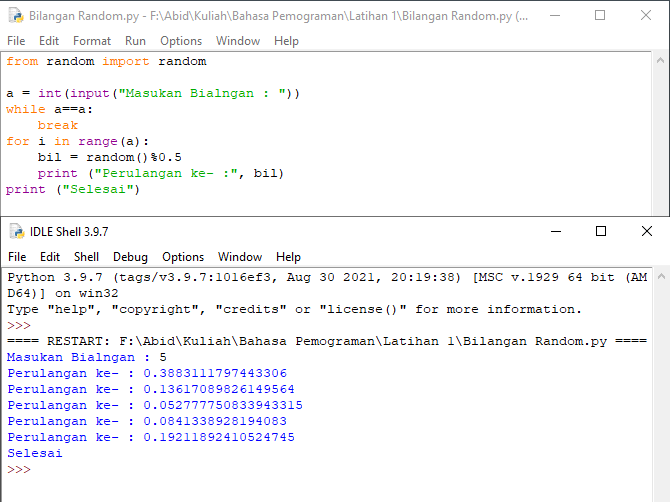
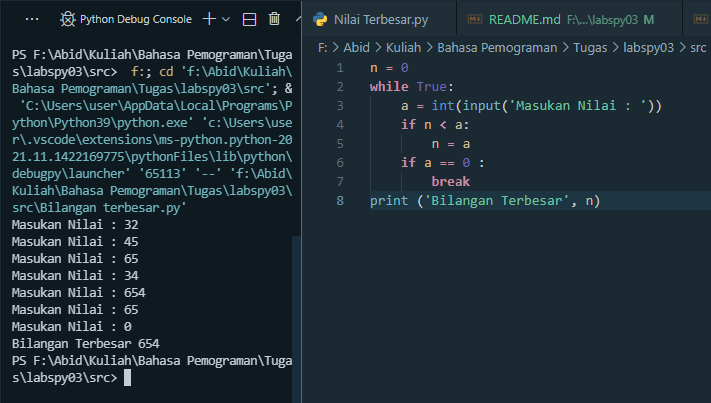
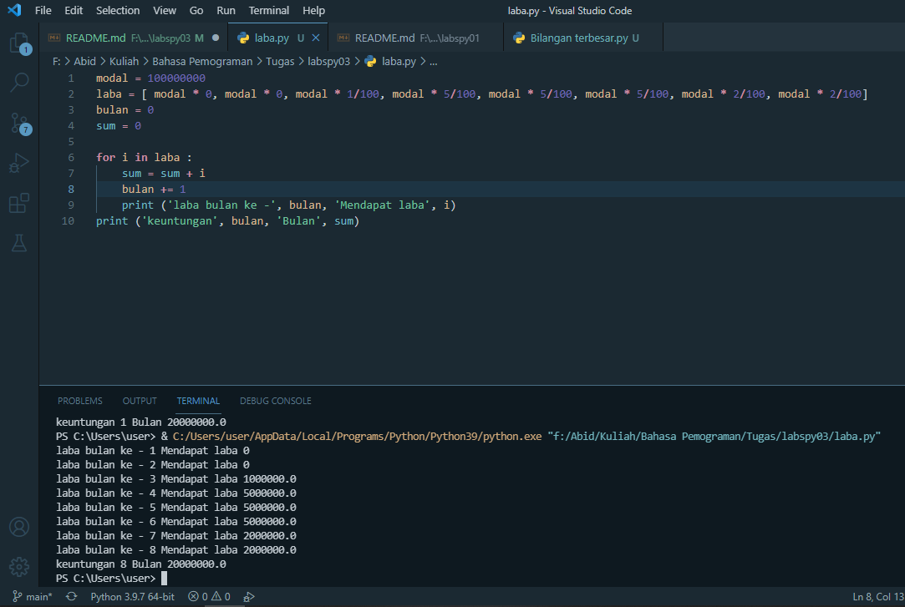

# labspy03

## Latihan 1
<p> Program Menampilkan N Bilangan Acak yang Lebih Kecil dari 0.5 </p>



Penjelasan :

   <p> 1. Import Module Bilangan Random </p>

```bash
from random import random
``` 

   <p> 2. Untuk menginput nilai yang ingin dikonversikan kedalam bilangan bulat (Integer) yang akan di masukan kedalam variabel a </p>

```bash
a = int(input("Masukan Bialngan : "))
```
  <p>  3. Untuk pengulangan range yang diinputkan oleh variable a </p>

```bash
while a==a:
    break
for i in range(a):
    bil = random()%0.5
```

  <p>  4. Untuk Menampilkan bialangan a </p>

```bash
 print ("Perulangan ke- :", bil)
print ("Selesai")
```

## Latihan 2

Program Sederhana Menentukan Bilangan Terbesar, dari Data N yang diinputka



Penjelasan :

1. membuat variabel 

```bash
n = 0
```
2. Untuk melakukan perulangan 

```bash
while true:
```
3. Untuk menginputkan data 

```bash
int(input('Masukan Bilangan : '))
```
4. Jika nilai n kurang dari a, n = a

```bash
if n > a:
    n = a    
```
5. Jika a = 0 maka perulangan akan berhenti

```bash
if a = 0:
    break
```
6. Menampilkan hasil

```bash
print ('bilangan Terbesar', n)
```

## Latihan 3

Program Menghitung Keuntungan Laba



Penjelasan :

1. Membuat variabel modal dan laba

```bash
modal = 100000000
laba = [modal * 0, modal * 0, modal * 1/100, modal * 1/100, modal * 5/100, modal * 5/100, modal * 5/100, modal * 3/100]
bulan = 0
sum = 0
```
2. untuk manampilkan modal awal

```bash
print ('Modal Awal', modal)
```
3. Untuk melakukan perulangan variabel i ke dalam variabel laba

```bash
for i in laba:
```
4. Tambahkan variabel sum dengan variabel i

```bash
sum = sum + i
```
5. Variabel bulan, untuk menentukan bulan yang akan ditambahkan dengan nilai 1 terus menerus hingga program berakhir

```bash
bulan += 1
```
6. Menampilkan laba dari bulan pertama hingga bulan terakhir

```bash
print("Laba pada bulan ke -", bulan, "mendapat laba   =", i)
```

7. Menampilkan keuntungan yang di dapat selama 8 bulan

```bash
print("Keuntungan yang didapat selama" , bulan, "bulan =", sum)
```